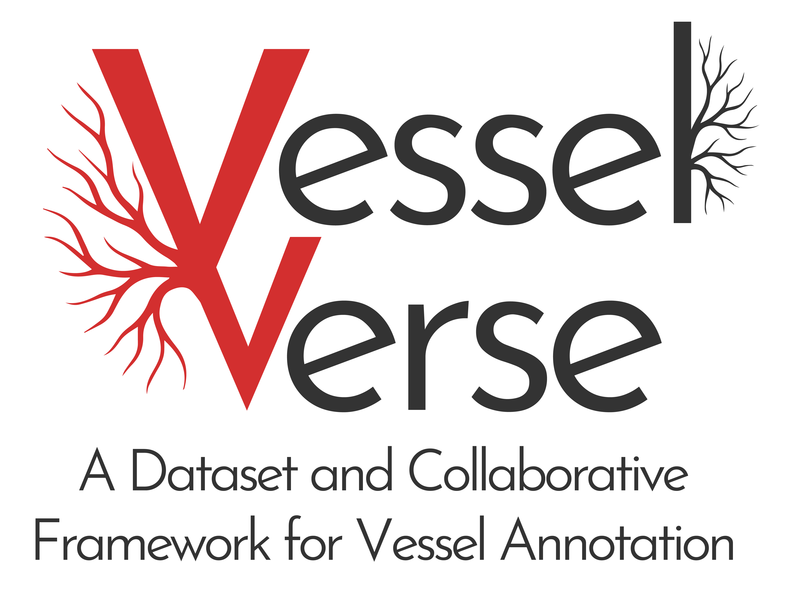
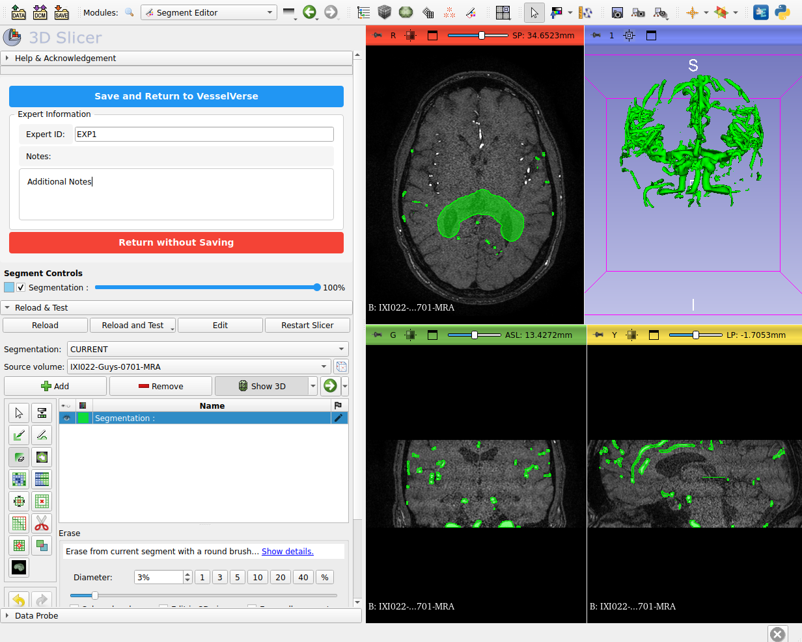
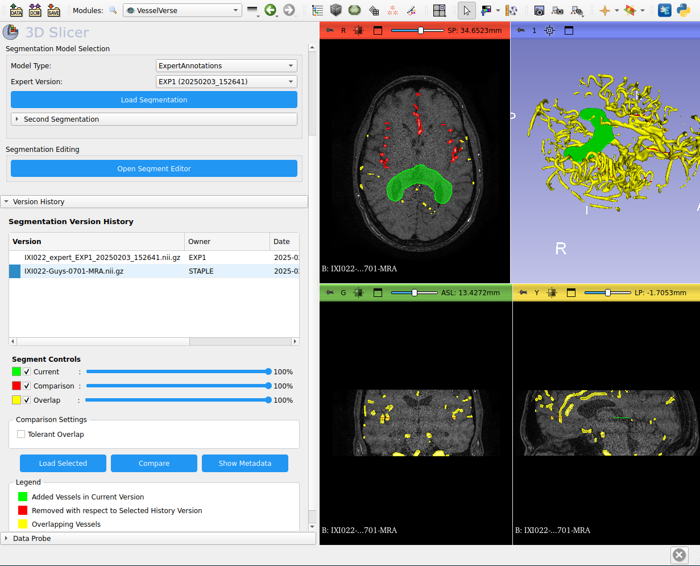

# VesselVerse: A Dataset and Collaborative Framework for Vessel Segmentation

## A Universal Framework for Version-Controlled Medical Image Annotations



A collaborative framework designed to incrementally improve ANY type of medical image annotation, beyond just brain vessels. Features a Git-like Data Version Control System integrated into a custom 3D Slicer extension for interactive visualization, annotation editing, and version comparison, with STAPLE-based consensus generation.

## Table of Contents

1. [Prerequisites](#prerequisites)
2. [Installation](#installation)
3. [Project Structure](#project-structure)
4. [Setup](#setup)
5. [Usage](#usage)
6. [Features](#features)
7. [Architecture](#architecture)

## Prerequisites

- 3D Slicer (Version 5.2.1 or later)
- Python 3.9+
- Git
- Sufficient disk space (at least 10GB recommended)

## Installation

### 1. Clone the Repository

```bash
git clone https://github.com/i-vesseg/VesselVerse-Framework.git
cd VesselVerse-Framework
```

### 2. Set Up the Data Directory Structure

```bash
mkdir -p data/{IXI_TOT,STAPLE,StochasticAL,nnUNet,A2V,Filtering,ExpertAnnotations,metadata}
```

### 3. Install the Slicer Extension

#### Method A: Using Slicer Extension Manager

1. Open 3D Slicer
2. Go to _Edit_ → _Application Settings_
3. Click on _Modules_
4. Add the VesselVerse extension directory:
   ```
   /path/to/Vesselverse-Framework/src/slicer_extension/VesselVerse
   ```
   to the additional module paths (drag & drop).

#### Method B: Manual Installation

1. Copy the VesselVerse extension to Slicer's extension directory:
   ```bash
   cp -r src/slicer_extension/VesselVerse ~/.local/share/3D\ Slicer/Extensions/
   ```
2. Restart Slicer

## Project Structure

A practical map of this repository with purpose of each part.

```
VesselVerse-Framework/
├── config.sh                         # Global config used by scripts (Slicer path, dataset name, Drive IDs, creds)
├── requirements.txt                  # Python runtime dependencies
├── README.md, LICENSE
├── .dvc/, .dvcignore                 # (optional) DVC metadata for remote data sync
├── .venv/                            # (optional) local Python virtualenv
├── docs/
│   ├── 3DSLICER/
│   │   ├── 3DSlicer_installation.md  # Slicer install guide
│   │   └── CONFIG.md                 # Slicer configuration tips
│   └── imgs/                         # Screenshots used in README
├── notebooks/                        # Jupyter notebooks for data prep/inspection
│   ├── check_req_version.ipynb
│   ├── extract_vessel_mask.ipynb
│   └── organize_data.ipynb
├── scripts/                          # Shell utilities to orchestrate workflows
│   ├── activate_owner_mode.sh        # Configure DVC remotes (storage/uploads) from config.sh
│   ├── install_slicer.sh             # Optional helper to install Slicer
│   ├── launch_slicer.sh              # Launch Slicer with VesselVerse module path
│   ├── restart_repo.sh               # Reset helper
│   ├── WSL_install_slicer.sh         # Windows/WSL variants
│   └── WSL_launch_slicer.sh
├── scripts_py/                       # Python batch tools
│   ├── compute_staple.py             # Run/coordinate STAPLE fusion pipelines
│   ├── generate_metadata.py          # Build metadata JSON for datasets/models
│   ├── staple_params.yaml            # STAPLE parameters
│   └── test_setup.py                 # Verify DVC remotes and test an uploads push
├── src/                              # Library code + Slicer extension module
│   ├── core/
│   │   ├── dataset.py                # Dataset abstraction and per-model path layout
│   │   └── staple.py                 # STAPLE utilities/implementation
│   ├── model_config/
│   │   ├── model_config.py           # Dataset & model registries (edit base_path here)
│   │   └── __init__.py
│   ├── slicer_extension/
│   │   ├── sql_files/                # SQL artifacts used by the Slicer module
│   │   └── VesselVerse/
│   │       ├── VesselVerse.py        # Main Slicer module (UI + logic)
│   │       ├── loading_dialog.py     # UI helpers
│   │       ├── opacity_slicer.py     # UI helpers
│   │       ├── CMakeLists.txt        # Slicer extension build manifest
│   │       └── Resources/Icons/      # Icons/assets
│   └── tracking/
│       ├── track_segmentations.py    # Track segmentation versions/paths
│       └── verify_tracking.py        # Validate tracking, generate reports
├── VESSELVERSE_DATA_IXI/             # Example dataset root (local, not versioned)
│   └── data/
│       ├── IXI_TOT/                  # Original images (NIfTI)
│       ├── STAPLE/, STAPLE_base/     # Consensus segmentations
│       ├── StochasticAL/, nnUNet/, A2V/, Filtering/
│       ├── ExpertAnnotations/, ExpertVAL/
│       └── metadata/                 # JSON metadata (expert and model)
└── VesselVerse-Framework/            # (duplicate copy) nested src/ for the Slicer module
   └── src/slicer_extension/VesselVerse/
```

Notes

- The nested `VesselVerse-Framework/src/...` is a duplicate of the extension code. Prefer the top-level `src/` paths; keep only one copy to avoid confusion.
- Change dataset roots (`base_path`) in `src/model_config/model_config.py`.
- Adjust Slicer binary path and Drive IDs in `config.sh`.

Key entry points

- Slicer module: `src/slicer_extension/VesselVerse/VesselVerse.py`
- Dataset registry: `src/model_config/model_config.py`
- Launch script: `scripts/launch_slicer.sh` (reads `config.sh` and adds module path)
- DVC remotes config: `scripts/activate_owner_mode.sh`

## Setup

### 1. Data Organization

1. Place your original MRA images in the `data/IXI_TOT/` directory

   - Format: NIFTI (.nii.gz)
   - Naming convention: `IXI[ID]-Guys-[NUM]-MRA.nii.gz`

2. Place model segmentations in their respective directories:
   - STAPLE consensus + Preprocessing (Vessel Enhancement): `data/STAPLE/`
   - STAPLE consensus w/o preprocessing: `data/STAPLE_base/`
   - StochasticAL results: `data/StochasticAL/`
   - nnUNet predictions: `data/nnUNet/`
   - A2V outputs: `data/A2V/`
   - Filtering results: `data/Filtering/`

### 2. Metadata Setup

The metadata directory will be automatically populated as you use the system. Initial structure:

```bash
mkdir -p data/metadata
```

## Usage

### 1. Starting the Application

1. Open 3D Slicer
2. In the module selector, choose _VesselVerse_
3. The VesselVerse interface will appear in the module panel

Optional:

```bash
bash scripts/launch_slicer.sh
```

Run this command to have direct access to 3D Slicer with the VesselVerse module

### 2. Loading Data

1. **Select Input Image**

   - Click $\blacktriangledown$ in the _Image Selection_ panel
   - Navigate in the `data/IXI_TOT` directory
   - Select your MRA image file

2. **Choose Model Type**

   - Select from the dropdown:
     - STAPLE
     - STAPLE_base
     - StochasticAL
     - nnUNet
     - A2V
     - Filtering
     - ExpertAnnotations
     - ...

3. **Load Segmentation**
   - Click _Load Segmentation_
   - For expert annotations, select the specific version from the dropdown


### 3. Making Modifications

1. **Open Segment Editor**

   - Click _Open Segment Editor_
   - Use Slicer's segmentation tools to make modifications

2. **Save Changes**
   - Enter your Expert ID
   - Add any relevant notes
   - Click _Save and Return to VesselVerse_



### 4. Compare multiple version from history

1. **Load Expert Segmentation**
   - Select ExpertAnnotations from Model Type
   - Select the modified segmentation and load it
2. **Compare with Historical Version**
   - Select version in Version History tree
   - Click _Compare_ button
3. **View Comparison**

   - ${\color{green}Green}$: Added vessels in current version
   - ${\color{red}Red}$: Removed vessels w.r.t. selected history version
   - ${\color{yellow}Yellow}$: Overlapping vessels

   Use opacity sliders to adjust visibility



### 5. Viewing Metadata

The metadata for each modification is stored in JSON format in:

```
data/metadata/[MODEL_TYPE]_expert_metadata.json
```


## Features

### Version Control

- Each modification creates a new version
- Original segmentation paths are tracked
- Complete modification history is maintained

### Metadata Tracking

- Expert identification
- Timestamp information
- File hashing for version control
- Modification notes
- Original segmentation references

### Multiple Model Support

- STAPLE consensus integration
- Support for multiple AI model outputs
- Expert annotation versioning

### Error Recovery

1. If a segmentation fails to load:

   - Close the current scene
   - Restart the module
   - Try loading the image again

2. If metadata fails to update:
   - Check the metadata directory permissions
   - Verify the JSON file structure
   - Try saving again with a different expert ID

### Contact

For questions or contributions, please contact:

Project Lead:

- Daniele Falcetta (daniele.falcetta@eurecom.fr - EURECOM, Biot, France)
- Maria A. Zuluaga (maria.zuluaga@eurecom.fr - EURECOM, Biot, France)

### Project Webpage:

#### https://i-vesseg.github.io/vesselverse/

### Dataset Repository:

#### Soon available

### Funding:

#### This work is supported by the ERC CoG CARAVEL and ANR JCJC project I-VESSEG (22-CE45-0015-01).

<table align="center">
  <tr>
      <td>
      
    </td>
    <td>
      
    </td>
        <td>
      
    </td>
  </tr>
</table>

## Architecture

For a detailed component overview and data flow (UI → dataset registry → filesystem → Slicer scene → save → metadata, and optional DVC sync), see:

- docs/ARCHITECTURE.md
